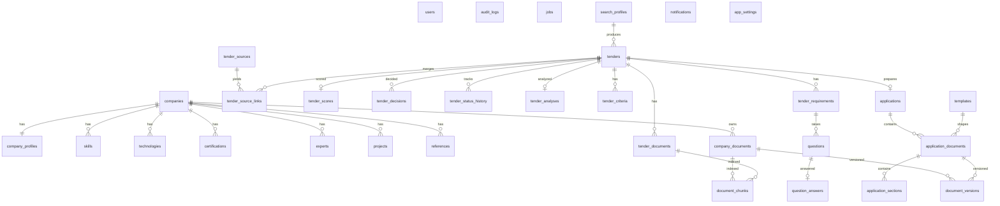

# 05 — Modèle de données

Plateforme intelligente de gestion des appels d'offres · Version 1.0 · Septembre 2026

Base : **PostgreSQL 16 + extension `vector` (pgvector)**. ORM : SQLAlchemy 2.0. Migrations : Alembic.

## Conventions

| Règle | Valeur |
|---|---|
| Clé primaire | `id UUID DEFAULT gen_random_uuid()` |
| Horodatage | `created_at`, `updated_at` en `TIMESTAMPTZ` (sauf tables d'événements : `created_at` seul) |
| Énumérations | colonne `VARCHAR(32)` + `Enum` Python (pas d'enum PostgreSQL, pour simplifier les migrations) |
| Listes simples | `TEXT[]` |
| Données semi-structurées | `JSONB` |
| Vecteurs | `VECTOR(1536)` (OpenAI `text-embedding-3-small`), index HNSW cosinus |
| Suppression | logique (`status = archived`) pour les documents ; physique pour le reste |

## Diagramme des relations

## Tables

### Socle

| Table | Colonnes principales | Phase |
|---|---|---|
| `users` | email (unique), password_hash, is_active, last_login_at | 1 |
| `audit_logs` | action, entity_kind, entity_id, payload JSONB, user_id, created_at | 1 |
| `jobs` | type, status (pending / running / done / failed), entity_kind, entity_id, progress, message, error, result JSONB, params JSONB, celery_task_id, started_at, finished_at | 1 |
| `app_settings` | key (unique), value JSONB | 11 |

### Entreprise

| Table | Colonnes principales | Phase |
|---|---|---|
| `companies` | legal_name, trade_name, description, country (ISO-2), city, address, website, email, phone, sectors TEXT[] | 2 |
| `company_profiles` | company_id (unique), positioning, ai_summary, ai_summary_updated_at | 2 |
| `skills` | company_id, name, category (expertise / service / savoir_faire), level, description | 2 |
| `technologies` | company_id, name, category (language / framework / database / cloud / tool / other), level, years_experience | 2 |
| `certifications` | company_id, name, issuer, category (technique / qualite / securite / autre), issued_at, expires_at, document_id → company_documents | 2 |
| `experts` | company_id, full_name, role, years_experience, skills TEXT[], bio, cv_document_id → company_documents | 2 |
| `projects` | company_id, title, client, sector, country, start_date, end_date, budget NUMERIC(14,2), currency, technologies TEXT[], description, results, is_reference | 2 |
| `references` | company_id, project_id, client_name, sector, description, contact_name, contact_email, document_id | 2 |
| `company_documents` | company_id, name, category (presentation / certification / attestation / reference / cv / administratif / financier / juridique / template / autre), storage_key, mime_type, size_bytes, sha256, version, status (draft / valid / expired / archived), issued_at, expires_at, description, tags TEXT[], extraction_status, extracted_text | 2 |
| `document_versions` | document_kind (company / application), document_id, version_number, storage_key, sha256, author, changelog, snapshot JSONB, created_at | 2 / 10 |

### Recherche et opportunités

| Table | Colonnes principales | Phase |
|---|---|---|
| `search_profiles` | name, countries[], regions[], sectors[], domains[], keywords[], budget_min, budget_max, currency, organization_types[], market_types[], technologies[], skills[], certifications[], experience_level, deadline_min_days, deadline_max_days, is_active, last_run_at | 3 |
| `tender_sources` | name, kind (search_engine / rss / portal / website / api), base_url, config JSONB, is_enabled, priority, last_run_at, last_status, last_error | 3 |
| `tenders` | reference, title, organization, organization_type, country, region, sector, market_type, budget_min, budget_max, currency, published_at, deadline_at, questions_deadline_at, source_url, description, summary, fingerprint (index), status, urgency, is_active, search_profile_id, raw JSONB, extra JSONB, embedding VECTOR(1536) | 3 – 4 |
| `tender_source_links` | tender_id, source_id, url (unique), title_seen, collected_at, raw JSONB | 3 |
| `tender_documents` | tender_id, name, source_url, storage_key, mime_type, size_bytes, sha256, download_status, extraction_status, extracted_text, page_count, error | 3 / 6 |

### Qualification

| Table | Colonnes principales | Phase |
|---|---|---|
| `tender_scores` | tender_id (unique), total, breakdown JSONB, strengths JSONB, weaknesses JSONB, justification, ai_adjustment, model, prompt_version, scoring_version, computed_at | 5 |
| `tender_decisions` | tender_id, decision (go / no_go), reason, decided_at | 5 |
| `tender_status_history` | tender_id, from_status, to_status, comment, changed_at | 5 |

### Analyse documentaire

| Table | Colonnes principales | Phase |
|---|---|---|
| `document_chunks` | owner_kind (tender_document / company_document), owner_id, tender_id, company_document_id, chunk_index, page, section, content, embedding VECTOR(1536), token_count, metadata JSONB | 6 |
| `tender_analyses` | tender_id (unique), object, organization, reference, budget, duration, location, key_dates JSONB, deliverables JSONB, requested_documents JSONB, eligibility_conditions JSONB, summary, model, prompt_version | 6 |
| `tender_criteria` | tender_id, name, weight, description, source_page | 6 |
| `tender_requirements` | tender_id, code (ex. `TECH-001`), category, description, is_mandatory, evidence_required, priority, status, justification, evidence JSONB, source_document_id, source_page, source_excerpt | 7 |
| `questions` | tender_id, requirement_id, text, priority (CRITIQUE / IMPORTANTE / FACULTATIVE), status (open / answered / skipped) | 7 |
| `question_answers` | question_id, answer, answered_at | 7 |

### Candidature

| Table | Colonnes principales | Phase |
|---|---|---|
| `templates` | name, document_type, description, sections JSONB, language, version, is_default | 9 |
| `applications` | tender_id (unique), status (draft / generating / review / validated / ready / submitted / archived) | 9 |
| `application_documents` | application_id, template_id, document_type, title, status (pending / generating / draft / validated / rejected / failed), current_version, export_storage_key, warnings JSONB | 9 |
| `application_sections` | document_id, key, title, position, content_md, status (generated / edited / validated / rejected), sources JSONB, missing_info JSONB, comment, prompt_version | 9 |

### Notifications

| Table | Colonnes principales | Phase |
|---|---|---|
| `notifications` | kind, title, body, severity (info / warning / critical), entity_kind, entity_id, is_read, read_at, emailed_at | 11 |

## Énumérations clés

| Énumération | Valeurs |
|---|---|
| Statut d'opportunité (`tenders.status`) | `NOUVEAU → A_ANALYSER → GO / NO_GO → PREPARATION → VALIDATION → PRET / SOUMIS → GAGNE / PERDU → ARCHIVE` |
| Urgence (`tenders.urgency`) | `none, low, medium, high, critical` |
| Statut d'exigence (`tender_requirements.status`) | `CONFORME, A_VERIFIER, NON_CONFORME, INFO_MANQUANTE` |
| Catégorie d'exigence | `administrative (ADM), technique (TECH), financiere (FIN), juridique (JUR), experience (EXP), equipe (EQU), certification (CERT), methodologie (METH), autre (AUT)` |
| Priorité de question | `CRITIQUE, IMPORTANTE, FACULTATIVE` |
| Type de document généré (`templates.document_type`) | `presentation, lettre_candidature, offre_technique, methodologie, comprehension_besoin, organisation_planning, equipe, cv, references, declaration` |

## Règles métier portées par le modèle

| Règle | Implémentation |
|---|---|
| RB-001 pas de doublon d'AO | `tender_source_links.url` unique + `tenders.fingerprint` indexé + `embedding` pour la similarité sémantique |
| RB-002 AO expiré non actif | `tenders.is_active` recalculé chaque nuit à partir de `deadline_at` |
| RB-004 score justifié | `tender_scores.justification` NOT NULL, `breakdown` conserve les sous-scores |
| RB-006 documents validés | `application_documents.status = validated` uniquement via l'action de validation ; `document_versions` créé à chaque validation |
| RB-007 documents expirés exclus | `company_documents.status` + `expires_at` ; propriété `is_usable` utilisée par toutes les sélections automatiques |
| Traçabilité IA | `tender_requirements.source_document_id / source_page / source_excerpt`, `application_sections.sources`, colonnes `model` / `prompt_version` |
